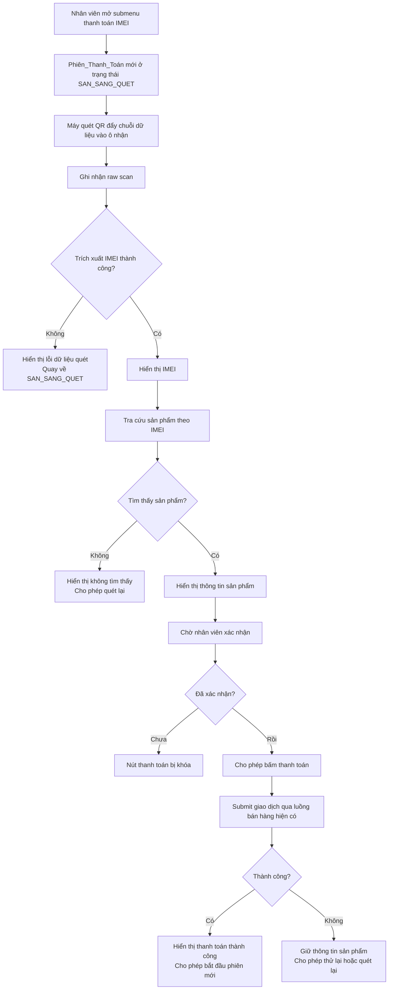

# Tài liệu Thiết kế

## Tổng quan

Tính năng `qr-imei-payment-flow` bổ sung một sub-menu thanh toán theo IMEI cho quy trình bán hàng hiện tại. Mục tiêu là cho phép nhân viên mở một màn hình con, nhận dữ liệu từ máy quét QR như một luồng nhập liệu bàn phím, trích xuất IMEI từ chuỗi quét, tra cứu đúng sản phẩm trong hệ thống, xác nhận lại thông tin hiển thị, rồi mới cho phép bấm thanh toán.

Thiết kế này giữ nguyên phạm vi đã chốt trong `requirements.md`: submenu tích hợp với QR scanner, trích xuất IMEI, tra cứu sản phẩm, nhân viên xác minh, sau đó bấm thanh toán. Không mở rộng sang xử lý nhiều sản phẩm trong một phiên, không thêm OCR/camera web, và không thay đổi nghiệp vụ bán hàng lõi ngoài việc thêm một luồng khởi tạo giao dịch từ IMEI.

### Tóm tắt nghiên cứu và cơ sở thiết kế

Thiết kế được xây dựng dựa trên các điểm tích hợp hiện có trong codebase:

- `src/components/warehouse-v2/SellProductForm.tsx`: hệ thống đã có form bán hàng gửi `POST /api/sales` với các trường chính như `ProductID`, `SalePrice`, `PaymentMethod`; đây là điểm tích hợp phù hợp cho bước tạo giao dịch thanh toán.
- `src/components/warehouse/ProductListV2.tsx`: bản ghi sản phẩm hiện đã chứa `ProductID`, `ProductName`, `IMEI`, `Status`, và các thao tác fetch/sell đang xoay quanh một sản phẩm cụ thể; điều này phù hợp với luồng "mỗi phiên chỉ gắn một IMEI với một bản ghi sản phẩm".
- `src/types/warehouse.ts`: hệ thống đã có các kiểu liên quan đến giao dịch xuất/bán hàng như `ExportOrder` và `PaymentStatus`, nên luồng mới nên tái sử dụng mô hình giao dịch hiện hữu thay vì tạo một loại giao dịch riêng.

Nguồn nội bộ tham chiếu:
- `./.kiro/specs/qr-imei-payment-flow/requirements.md`
- `src/components/warehouse-v2/SellProductForm.tsx`
- `src/components/warehouse/ProductListV2.tsx`
- `src/types/warehouse.ts`

## Kiến trúc

Tính năng được thiết kế như một luồng UI điều phối trạng thái phiên, bao quanh các API và nghiệp vụ bán hàng đã có.



### Quyết định kiến trúc

- Sử dụng **stateful UI workflow** ở frontend để điều phối phiên quét thay vì để backend giữ session server-side. Điều này phù hợp với luồng thao tác của máy quét và giảm phụ thuộc vào trạng thái tạm trên máy chủ.
- Tách **trích xuất IMEI** thành một lớp logic riêng khỏi component hiển thị để dễ kiểm thử và dễ thay đổi quy tắc parser sau này.
- Tái sử dụng **dịch vụ/endpoint bán hàng hiện có** cho bước thanh toán để tránh phân nhánh nghiệp vụ và đảm bảo dữ liệu hóa đơn/giao dịch tiếp tục đi qua cùng một pipeline.
- Ràng buộc **một phiên chỉ xử lý một IMEI và một bản ghi sản phẩm** để đáp ứng Yêu cầu 6 và giảm nguy cơ thanh toán nhầm.

## Thành phần và giao diện

### 1. `QrImeiPaymentSubmenu`

Thành phần UI chính chịu trách nhiệm:
- hiển thị vùng nhận dữ liệu từ máy quét;
- hiển thị raw scan, IMEI đã trích xuất, trạng thái tìm kiếm và thông tin sản phẩm;
- quản lý nút xác nhận, nút thanh toán, nút xóa thao tác, nút quét mới;
- điều phối trạng thái `Phiên_Thanh_Toán`.

#### Giao diện đề xuất

```ts
interface QrImeiPaymentSubmenuProps {
  isOpen: boolean;
  onClose: () => void;
  onPaymentSuccess?: (result: PaymentResult) => void;
}
```

### 2. `ScanInputCapture`

Thành phần con hoặc hook chuyên nhận dữ liệu từ máy quét QR theo kiểu keyboard wedge.

Trách nhiệm:
- giữ focus tại vùng nhập liệu khi submenu mở;
- gom chuỗi ký tự quét cho đến khi gặp ký tự kết thúc hoặc sự kiện submit;
- chuyển toàn bộ chuỗi raw scan sang tầng xử lý phiên.

#### Giao diện đề xuất

```ts
interface ScanInputCaptureProps {
  disabled?: boolean;
  autoFocus?: boolean;
  onScanReceived: (rawValue: string) => void;
}
```

### 3. `extractImeiFromQrPayload`

Hàm nghiệp vụ thuần dùng để phân tích chuỗi quét và lấy ra đúng một IMEI hợp lệ.

#### Giao diện đề xuất

```ts
interface ExtractImeiResult {
  success: boolean;
  imei?: string;
  errorCode?: 'EMPTY_SCAN' | 'IMEI_NOT_FOUND' | 'MULTIPLE_IMEI_FOUND' | 'INVALID_FORMAT';
}

declare function extractImeiFromQrPayload(rawValue: string): ExtractImeiResult;
```

Quy tắc xử lý:
- nhận vào đúng chuỗi raw scan được máy quét gửi;
- chuẩn hóa khoảng trắng/ký tự xuống dòng trước khi parse;
- chỉ chấp nhận kết quả khi tìm được đúng một IMEI theo định dạng hệ thống cho phép;
- trả lỗi rõ nghĩa nếu không tìm thấy hoặc tìm thấy nhiều IMEI.

### 4. `ProductLookupService`

Lớp truy vấn sản phẩm theo IMEI.

#### Giao diện đề xuất

```ts
interface LookupProductByImeiResponse {
  found: boolean;
  product?: ProductLookupRecord;
  errorMessage?: string;
}

interface ProductLookupRecord {
  ProductID: number;
  ProductName: string;
  ProductCode?: string;
  IMEI: string;
  Status: string;
  SalePrice?: number;
}

declare function lookupProductByImei(imei: string): Promise<LookupProductByImeiResponse>;
```

Nguồn dữ liệu nên ưu tiên cùng tập dữ liệu đang phục vụ danh sách sản phẩm có IMEI trong `ProductListV2`, nhằm đảm bảo đồng nhất giữa màn hình quản lý hàng và màn hình thanh toán theo IMEI.

### 5. `ImeiPaymentSessionStore`

Store cục bộ trong component hoặc custom hook để quản lý vòng đời phiên thao tác.

#### Giao diện đề xuất

```ts
type PaymentSessionStatus =
  | 'IDLE'
  | 'READY_FOR_SCAN'
  | 'PARSING_SCAN'
  | 'LOOKING_UP_PRODUCT'
  | 'AWAITING_CONFIRMATION'
  | 'READY_TO_PAY'
  | 'PAYING'
  | 'PAYMENT_SUCCESS'
  | 'ERROR';

interface ImeiPaymentSessionState {
  sessionId: string;
  status: PaymentSessionStatus;
  rawScanValue: string | null;
  extractedImei: string | null;
  product: ProductLookupRecord | null;
  isConfirmed: boolean;
  errorMessage: string | null;
}
```

### 6. `PaymentSubmissionAdapter`

Lớp chuyển đổi dữ liệu từ phiên IMEI sang payload của luồng bán hàng hiện hữu.

#### Giao diện đề xuất

```ts
interface SubmitImeiPaymentInput {
  productId: number;
  imei: string;
  salePrice: number;
  paymentMethod: string;
}

interface PaymentResult {
  success: boolean;
  invoiceNumber?: string;
  errorMessage?: string;
}

declare function submitImeiPayment(input: SubmitImeiPaymentInput): Promise<PaymentResult>;
```

Thiết kế này nên gọi cùng endpoint/nghiệp vụ mà `SellProductForm.tsx` đang dùng (`POST /api/sales`), nhưng thêm ràng buộc chỉ cho submit khi sản phẩm lookup được khớp với IMEI của phiên hiện tại.

## Mô hình dữ liệu

### 1. Mô hình phiên thanh toán IMEI

```ts
interface QrImeiPaymentSession {
  sessionId: string;
  rawScanValue: string | null;
  extractedImei: string | null;
  productId: number | null;
  productSnapshot: {
    ProductName: string;
    ProductCode?: string;
    IMEI: string;
    Status: string;
    SalePrice?: number;
  } | null;
  confirmation: {
    verifiedByStaff: boolean;
    verifiedAt: string | null;
  };
  payment: {
    status: 'NOT_STARTED' | 'IN_PROGRESS' | 'SUCCESS' | 'FAILED';
    invoiceNumber: string | null;
    errorMessage: string | null;
  };
  createdAt: string;
  updatedAt: string;
}
```

Mô hình này chủ yếu sống ở frontend trong vòng đời submenu. Chỉ các trường cần thiết cho giao dịch cuối cùng mới được gửi sang backend.

### 2. Bản ghi lookup sản phẩm

Dựa trên cấu trúc đang thấy trong codebase, bản ghi trả về tối thiểu cần có:

```ts
interface ProductLookupRecord {
  ProductID: number;
  ProductName: string;
  ProductCode?: string;
  IMEI: string;
  Status: 'IN_STOCK' | 'RESERVED' | 'SOLD' | string;
  SalePrice?: number;
}
```

### 3. Payload thanh toán

Payload gửi đi nên bám sát payload đang được dùng bởi form bán hàng hiện tại.

```ts
interface ImeiPaymentRequest {
  ProductID: number;
  SalePrice: number;
  PaymentMethod: string;
  ScannedIMEI: string;
}
```

`ScannedIMEI` là trường bổ sung nên có ở tầng request/log để hỗ trợ truy vết và kiểm tra chéo, ngay cả khi backend cuối cùng chỉ cập nhật giao dịch dựa trên `ProductID`.

## Xử lý lỗi

### Lỗi nhận dữ liệu quét

- Nếu chuỗi quét rỗng, hiển thị lỗi "Không nhận được dữ liệu từ máy quét" và trả về trạng thái sẵn sàng quét.
- Nếu chuỗi quét không parse được IMEI hợp lệ, hiển thị lỗi nêu rõ dữ liệu quét không hợp lệ, không giữ lại dữ liệu sản phẩm cũ.
- Nếu parser phát hiện nhiều hơn một IMEI hợp lệ trong cùng chuỗi, chặn luồng thanh toán và yêu cầu quét lại để tránh nhập nhằng.

### Lỗi tra cứu sản phẩm

- Nếu không tìm thấy sản phẩm theo IMEI, hiển thị thông báo không tìm thấy và cho phép quét mới ngay trong cùng submenu.
- Nếu tìm thấy sản phẩm nhưng `Status` không ở trạng thái sẵn sàng bán, hiển thị trạng thái hiện tại của sản phẩm và không cho xác nhận thanh toán.
- Nếu lỗi mạng hoặc lỗi API khi lookup, hiển thị lỗi tạm thời nhưng không đóng submenu; nhân viên có thể thử quét lại hoặc bấm thử lại.

### Lỗi xác nhận và trạng thái phiên

- Nút thanh toán luôn bị vô hiệu hóa cho đến khi `verifiedByStaff = true`.
- Khi nhân viên bấm xóa thao tác hiện tại, toàn bộ `rawScanValue`, `extractedImei`, `productSnapshot`, `errorMessage`, `isConfirmed` phải được reset.
- Sau khi thanh toán thành công, hành động quét mới phải tạo `sessionId` mới và không tái sử dụng dữ liệu của phiên trước.

### Lỗi thanh toán

- Nếu request thanh toán thất bại ở backend, giữ nguyên thông tin sản phẩm và IMEI trong phiên để nhân viên quyết định thử lại hoặc hủy.
- Nếu backend trả về lỗi xung đột dữ liệu (ví dụ sản phẩm vừa được bán ở nơi khác), hiển thị lỗi nghiệp vụ rõ ràng và khóa hành động thanh toán tiếp theo cho tới khi nhân viên quét lại.
- Chặn double-submit bằng cách chuyển trạng thái sang `PAYING` và khóa các nút hành động cho đến khi có kết quả.

## Chiến lược kiểm thử

Tính năng này **không phù hợp để đưa Correctness Properties vào tài liệu thiết kế**, vì phần lớn phạm vi là UI workflow, điều phối trạng thái phiên, tích hợp thiết bị quét theo cơ chế nhập liệu, tra cứu dữ liệu và submit giao dịch có side effect. Đây không phải bài toán thuần input/output đủ mạnh để mô tả bằng property-based testing ở cấp tính năng.

Thay vào đó, chiến lược kiểm thử nên chia làm ba lớp:

### 1. Unit tests

Tập trung vào logic nhỏ, tách biệt:
- kiểm thử `extractImeiFromQrPayload` với các mẫu QR hợp lệ, không hợp lệ, rỗng, chứa nhiều candidate;
- kiểm thử reducer/store của `ImeiPaymentSessionStore` cho các chuyển trạng thái chính;
- kiểm thử điều kiện bật/tắt nút thanh toán dựa trên `product`, `status`, `isConfirmed`.

### 2. Integration tests

Tập trung vào luồng người dùng và tích hợp component:
- mở submenu và xác nhận vùng nhận dữ liệu quét hiển thị đúng;
- mô phỏng scanner input để xác nhận raw scan được ghi nhận;
- khi IMEI hợp lệ, xác nhận hệ thống gọi lookup và hiển thị đúng tên sản phẩm, mã sản phẩm, IMEI, trạng thái;
- khi chưa xác nhận, nút thanh toán bị khóa; khi đã xác nhận, nút thanh toán được bật;
- khi submit thành công, hiển thị trạng thái thanh toán thành công;
- khi submit lỗi, giữ lại thông tin sản phẩm để thử lại.

### 3. API/contract tests

Tập trung vào biên tích hợp với backend:
- endpoint lookup theo IMEI trả về đúng shape dữ liệu tối thiểu cho UI;
- endpoint bán hàng chấp nhận payload từ luồng IMEI và tạo giao dịch gắn với `ProductID`/IMEI tương ứng;
- kiểm tra backend từ chối trường hợp sản phẩm không còn ở trạng thái sẵn sàng bán.

### Công cụ và cấu hình đề xuất

- Dùng test runner hiện có của dự án cho unit/integration tests.
- Với component tests, ưu tiên mock fetch/API để kiểm tra luồng UI ổn định.
- Với parser IMEI, dùng example-based test thay vì property-based test, vì quy tắc parser phụ thuộc định dạng QR được nghiệp vụ chấp nhận chứ không phải một miền dữ liệu vô hạn đã được đặc tả đầy đủ.
- Bổ sung test case hồi quy cho các nhánh lỗi quan trọng: QR không hợp lệ, không tìm thấy sản phẩm, sản phẩm không sẵn sàng bán, thanh toán thất bại, reset phiên.

## Ghi chú triển khai

- `requirements.md` đã tồn tại đúng theo workflow requirements-first.
- Bước tiếp theo sau khi design được duyệt là tạo `tasks.md` để chia nhỏ triển khai frontend state flow, parser IMEI, lookup service, tích hợp thanh toán và kiểm thử.
